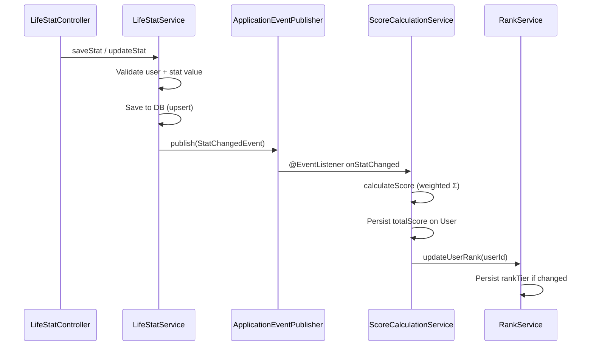

# Life Stats

Users rate themselves across 5 life categories (1–100). Each stat change is tracked in an audit history and triggers automatic score recalculation via a Spring Application Event.

## Key Files

| File | Role |
|---|---|
| `models/StatCategory.java` | Enum defining the 5 categories with weights |
| `models/LifeStat.java` | Current stat value per user per category |
| `models/LifeStatHistory.java` | Append-only audit log of stat changes |
| `service/LifeStatService.java` | Business logic — save, bulk save, update, get |
| `controller/LifeStatController.java` | REST controller at `/api/v1/stats/**` |
| `events/StatChangedEvent.java` | Spring event triggering score recalculation |
| `repository/LifeStatRepository.java` | JPA repository for `LifeStat` |
| `repository/LifeStatHistoryRepository.java` | JPA repository for `LifeStatHistory` |

## The 5 Stat Categories

```java
public enum StatCategory {
    CAREER("Career",           1, 100, 1.2),
    WEALTH("Wealth",           1, 100, 1.0),
    FITNESS("Fitness",         1, 100, 1.1),
    EDUCATION("Education",     1, 100, 1.3),
    SOCIAL_INFLUENCE("Social Influence", 1, 100, 0.9);
}
```

Each category has:
- `displayName` — human-readable name
- `minValue` / `maxValue` — valid range (1–100)
- `weight` — multiplier for score calculation (Education is highest at 1.3)
- `isValidValue(int)` — range validation method

## Data Model

### LifeStat (current values)
- Unique constraint on `(user_id, category)` — one stat per category per user
- Fields: `id`, `userId`, `category`, `value`, `previousValue`, `lastUpdated`, `metadata`

### LifeStatHistory (audit log)
- Append-only — new row every time a stat is updated
- Fields: `id`, `userId`, `category`, `oldValue`, `newValue`, `reason`, `changedAt`

## Operations

### Save Single Stat (`POST /api/v1/stats`)
- **Upsert pattern**: creates new or updates existing stat for the user+category
- Request: `StatInputRequest { category, value, metadata? }`
- Response: `LifeStatResponse { category, displayName, value, pointsContributed, lastUpdated, metadata }`
- Publishes `StatChangedEvent` → triggers score recalculation

### Bulk Save Stats (`POST /api/v1/stats/bulk`)
- Used during **onboarding** to submit all 5 stats at once
- Request: `BulkStatInputRequest { stats: List<StatInputRequest> }`
- Response: `List<LifeStatResponse>`
- Runs in a single `@Transactional` — all-or-nothing
- Publishes ONE `StatChangedEvent` after all stats are saved

### Get User Stats (`GET /api/v1/stats`)
- Returns all stats for the authenticated user
- Response: `List<LifeStatResponse>`

### Update Single Stat (`PUT /api/v1/stats/{category}`)
- Updates an **existing** stat (throws `StatNotFoundException` if not found)
- Request: `StatUpdateRequest { newValue, reason? }`
- Response: `StatUpdateResponse { category, displayName, previousValue, newValue, totalScore, scoreChange }`
- Records history entry in `life_stat_history` table
- Publishes `StatChangedEvent` → recalculates score + rank

## Event Flow



## Validation Rules

- Category must not be null
- Value must be between 1 and 100 (validated at both DTO level with `@Min`/`@Max` and service level with `StatCategory.isValidValue()`)
- User must exist (throws `UserNotFoundException`)
- For update: stat must already exist (throws `StatNotFoundException`)

## DTOs

| DTO | Type | Fields |
|---|---|---|
| `StatInputRequest` | Request | `category` (required), `value` (1–100, required), `metadata?` |
| `BulkStatInputRequest` | Request | `stats: List<StatInputRequest>` (1–5 items, not empty) |
| `StatUpdateRequest` | Request | `newValue` (1–100, required), `reason?` |
| `LifeStatResponse` | Response | `category`, `displayName`, `value`, `pointsContributed`, `lastUpdated`, `metadata` |
| `StatUpdateResponse` | Response | `category`, `displayName`, `previousValue`, `newValue`, `totalScore`, `scoreChange` |

## Adding New Stat Categories

1. Add enum constant to `StatCategory` with appropriate weight
2. Create Flyway migration if schema changes needed
3. No service/controller changes needed — it's enum-driven
